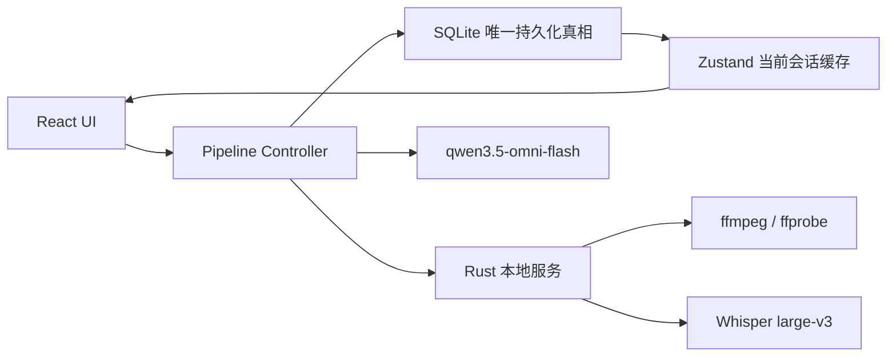

# Rain 本地视频真实可用修复设计

**日期：** 2026-07-17
**状态：** 已获设计批准，待用户审阅本文后编写实施计划
**首轮范围：** 本地视频完整闭环；在线 URL 导入明确留到后续阶段。

## 1. 目标与验收对象

Rain 首轮必须让用户实际完成“导入本地视频 → 转录 → 结构化 → 学习 → 提问”的闭环。测试全绿、页面显示 `ready` 或项目进度文档均不构成可用证据。

本轮必须使用以下用户提供的视频完成一次完整冷启动 E2E 验收：

`D:\xiazaiwenjian\bilidown\【华中科技大学】电子技术基础 张林（全138讲）电子信息工程专业必修课\1.2.1 信号及其放大.mp4`

已核验的输入属性：

- SHA-256：`3870B5BD62E574685AC99A8E44295F5E44AC44B76343666742C1C4CA48365F8A`
- 时长：3392.806893 秒（约 56 分 33 秒）
- 视频：H.264，360×360；音频：AAC 44.1 kHz 双声道。

## 2. 明确决定

| 项目 | 决定 |
|---|---|
| 首轮范围 | 本地视频完整闭环；在线 URL 导入不假装可用，留给后续阶段。 |
| ASR | 本地 Whisper `large-v3`，GPU 优先、CPU 回退。 |
| 其余 AI | `qwen3.5-omni-flash`，DashScope OpenAI-compatible base URL。 |
| 模型职责 | Whisper 只做语音转文字；Qwen 做结构化、翻译、助手和按需视觉理解。 |
| API Key 存储 | 遵循 PRD/M15：SQLite `setting` 表明文；模型池 JSON 不重复保存 Key。 |
| 证据 | 生成完整、脱敏的证据包。 |
| 成功语义 | 只有真实 ASR、通过校验的 Qwen 结构和持久化事务都成功，才能标记 `ready`。 |

Qwen3.5-Omni Flash 支持 OpenAI-compatible 调用、多模态输入和最长一小时视频；但本设计仍遵循 PRD：结构化只处理转录文本，助手按需理解当前画面，避免重复上传整段视频。

## 3. 现状问题与设计约束

审计已确认当前 `pipeline-orchestrator` 在 Whisper 或 LLM 失败时会静默写入演示英文句子和默认结构，随后把视频标为 `ready`。这条路径必须完全移除；错误不能用 mock 数据掩盖。

当前设置只有进入设置页后才加载，模型池恢复时还会生成新 ID，导致角色映射失效。当前本地导入没有传递 Whisper 模型路径，在线导入没有实际下载，Rust 的若干 ASR/导入接口只是占位，且若干可见按钮没有行为。这些事实决定本轮要采用 fail-closed 的完整闭环，而不是在页面上补成功状态。

锁定 harness 不得修改。新增测试必须验证实际行为，不能继续用“函数存在”或空对象断言代表 E2E。

## 4. 架构与状态机

- Rust 负责文件系统、媒体探测、缩略图、音频转换、Whisper、GPU/CPU 后端选择、取消和进度事件。
- 前端 Pipeline Controller 负责 Qwen 调用、分块、结果校验、状态推进和 SQLite 持久化，保持 M20 的 LLM 前端直连边界。
- SQLite 是唯一持久化真相；Zustand 只缓存当前界面状态和已加载的数据。
- 应用启动时即加载模型配置、角色映射和 Key；不能依赖用户先打开设置页。
- 本地导入串行执行。缩略图、临时媒体和证据写入 Rain 应用数据目录或专用证据目录，绝不写在原视频旁。
- 所有视频、节点和句子 ID 使用 UUID/全局唯一 ID，禁止跨视频冲突的静态编号。

状态路径固定为：

`pending → processing/asr → processing/stage2 → processing/merging → ready`

失败进入 `failed`，用户取消进入 `cancelled`。每个状态包含当前 `stage`、进度、可恢复检查点和真实错误。禁止 demo sentence、default structure、浏览器 fallback 或任何静默成功分支。

## 5. 本地视频数据流

1. 导入时验证文件存在、可读且包含可解码的视频与音频流；保存原始绝对路径、大小、SHA-256、时长和媒体参数。缩略图写入应用数据目录。
2. Rust 以已配置的 `ggml-large-v3.bin` 转录完整视频。优先使用 CUDA/GPU；不可用时明确记录原因并回退 CPU。ffmpeg 产生唯一临时路径，取消时清理。
3. Whisper 输出被标准化为非空、时间单调、连续的句子，语言检测使用 Unicode 代码点而非 UTF-8 字节比率。
4. ASR 全部成功后，用一个 SQLite 事务写入句子和 `Video.language`。若事务不存在，不得保留半份转录；若存在，重启可跳过 ASR。
5. Stage2 按句子边界和 Token 预算分块。块之间可带少量只读上下文，但每个句子只拥有一个归属块。
6. Qwen 输入包含不可变 `sentenceId`、时间戳和原文。Qwen 输出只包含树结构、标题、段落类型、首尾句子 ID 和必要翻译；它不能改写或重新成为原文来源。
7. 每个响应必须先通过 JSON、schema、时间线、树和“所有句子恰好覆盖一次”校验。解析/校验失败最多以同一模型重试两次；之后进入 `failed`。
8. 分块结果按检查点保存；全局合并只传递紧凑目录信息。全部验证后，以事务写入正式节点并标记 `ready`。

英文视频的翻译仍由 Qwen 生成；本次中文验收视频不触发翻译。

## 6. 设置、界面与 AI 助手

### 设置

- 保存模型前执行真实连接测试，验证 endpoint、Key、模型名和 JSON 输出能力。
- Key 仅保存到 `setting` 表的 `api_key.<模型别名>`；UI 掩码展示，模型池只保存非敏感配置与稳定 ID。
- 修复模型池恢复和角色映射；启动自动加载。

### 导入与学习

- 导入卡展示真实阶段、百分比、最后错误和可用操作：处理中可取消，失败可查看/重试，已取消可重启，就绪可学习。
- 取消必须真正中断 Whisper 或 Qwen 请求；已完成的 ASR/块检查点按状态机恢复。
- 学习页使用正确的 Tauri 文件 URL，打通播放/暂停、seek、音量、字幕、逐句高亮、双击跳转、目录跳转和播放进度持久化。
- 所有可见按钮必须真实工作。首轮未完成的在线导入或高级编辑必须隐藏或明确标为后续阶段，不能留下无响应控件。

### 助手上下文

助手不固定截断到当前章节，而是采用分层上下文：

1. 始终给出全局目录、章节摘要和时间范围。
2. 给出当前章节完整原文及相邻段落。
3. 用 SQLite 全文搜索在全视频检索与问题相关的其他句子和章节。
4. 对总结、前后对比和全局问题自动走全局模式，分批读取并汇总整篇转录。
5. 回答包含来源时间点和句子引用；证据不足时明确说明。
6. UI 提供“当前位置 / 全视频”范围开关。

普通问题只调用文本上下文；“解释画面”由 Rust 在当前时间点导出 JPEG，与相关转录一起交给 Qwen。截图仅用于当次请求，随后清理。流式请求使用可取消控制器，停止按钮立即中止并保留已收到文本。

## 7. 错误、安全与恢复

- 网络、认证、模型不存在、JSON 无效、媒体缺失、GPU 不可用、磁盘错误和用户取消使用不同错误码及可操作中文提示。
- 所有日志和证据移除 Authorization、API Key 和不必要的私人路径。
- 实际数据库按已批准 PRD 明文保存 Key；证据数据库导出必须去除 `api_key.*` 行，并单独记录脱敏说明。
- 重启按持久化检查点恢复：有完整 ASR 则从 Stage2 恢复；有有效块则继续未完成块；无有效检查点则重跑对应阶段。

## 8. 验证与证据包

新增行为测试覆盖：

- Whisper 的真实音频、时间戳、语言检测、GPU/CPU 后端和取消；
- Qwen 的鉴权、JSON 模式、重试、取消、错误分类和覆盖校验；
- 数据库事务、重启恢复和跨视频 ID；
- 导入状态、播放/seek、字幕高亮、删除、摘注、助手停止和当前帧请求。

最终在新的应用数据目录进行冷启动，并以指定视频执行一次完整流程。只有满足以下条件才可宣称首轮真正可用：

1. 完整视频用真实 Whisper 处理，证据记录 GPU 使用情况、CPU 回退能力和耗时。
2. 至少抽查开头、中间、结尾等十个时间点，人工对照声音检查转录。
3. 每个 Qwen 块都有真实响应，最终结构中每个句子恰好一次。
4. 重启后仍能播放、恢复进度、加载目录、原文和字幕。
5. 助手完成当前位置、跨章节和当前画面问题，并给出可跳转时间引用。
6. 实测一次处理中取消和一次断点恢复。
7. 不出现演示英文、默认结构、无响应按钮或静默失败。

每次验收写入 `evidence/rain-real-e2e-<run-id>/`，至少包含：媒体元数据、转录、脱敏 Qwen 请求/响应、校验报告、耗时、测试与构建日志、脱敏数据库导出和关键截图。API Key 绝不进入证据包。

## 9. 非目标

- 本轮不实现实际在线视频下载、字幕抓取或 URL 全流程。
- 本轮不把完整视频重复发送给 Qwen 用于结构化。
- 本轮不以模拟数据、空 harness 或文档进度替代真实运行证据。
